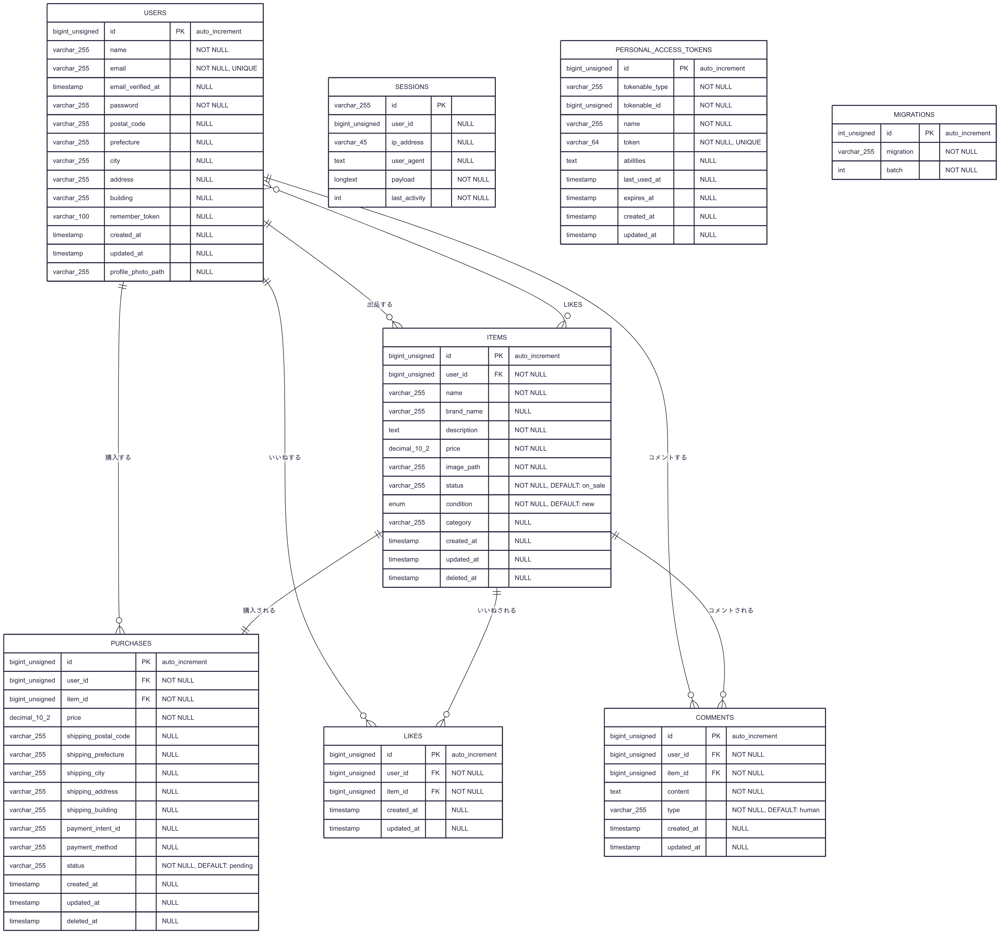

# フリーマーケットアプリケーション

## 環境構築

### Laravel環境構築
```bash
# 1. リポジトリのクローン
git clone git@github.com:hiroakiokamura/freemarket-test1.git
cd freemarket-test1

# 2. Docker環境の起動
docker-compose up -d --build

# 3. Composer依存関係のインストール
docker-compose exec app composer install

# 4. 環境ファイルの準備
cp src/.env.example src/.env

# 5. アプリケーションキーの生成
docker-compose exec app php artisan key:generate

# 6. ストレージリンクの作成
docker-compose exec app php artisan storage:link

# 7. データベースマイグレーション
docker-compose exec app php artisan migrate

# 8. データベースシーダー実行
docker-compose exec app php artisan db:seed

# 9. フロントエンド
npm install
npm run dev
```

書き込み権限のエラーが発生する場合は
```bash
sudo chown -R ユーザー名:ユーザー名 .
sudo chmod -R 777 *
```

## 開発環境

### アクセスURL
- 商品一覧（トップ）画面：http://localhost:8000/
- ユーザー登録画面：http://localhost:8000/register/
- ユーザー登録：http://localhost:8000/login/
- phpMyAdmin：http://localhost:8080/

### 使用技術（実行環境）
- PHP 8.3.12
- Laravel 10.48.21
- MySQL 8.0.26
- nginx 1.21.1

## データベース構造

### ER図



