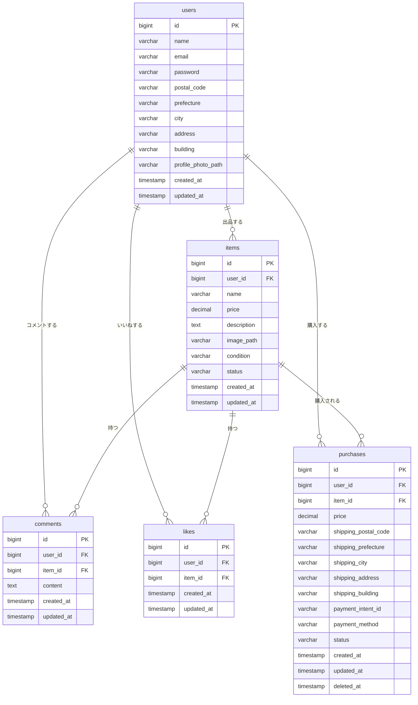

# フリーマーケットアプリケーション

## 環境構築

### Laravel環境構築
```bash
git clone git@github.com:hiroakiokamura/freemarket-test1.git
DockerDesktop を起動しdocker-compose up -d --build
cd src
docker-compose exec php composer install
.env.exampleファイルの名前を.envに変更
php artisan key:generate
docker-compose exec php php artisan migrate
docker-compose exec php php artisan db:seed
npm install
npm run dev
```

書き込み権限のエラーが発生する場合は
```bash
sudo chown -R ユーザー名:ユーザー名 .
sudo chmod -R 777 *
```

## 開発環境

### アクセスURL
- 商品一覧（トップ）画面：http://localhost:8000/
- ユーザー登録画面：http://localhost:8000/register/
- ユーザー登録：http://localhost:8000/login/
- phpMyAdmin：http://localhost:8080/

### 使用技術（実行環境）
- PHP 8.3.12
- Laravel 10.48.21
- MySQL 8.0.26
- nginx 1.21.1

## データベース構造

### ER図


以下はER図のMermaid記法での定義です：


